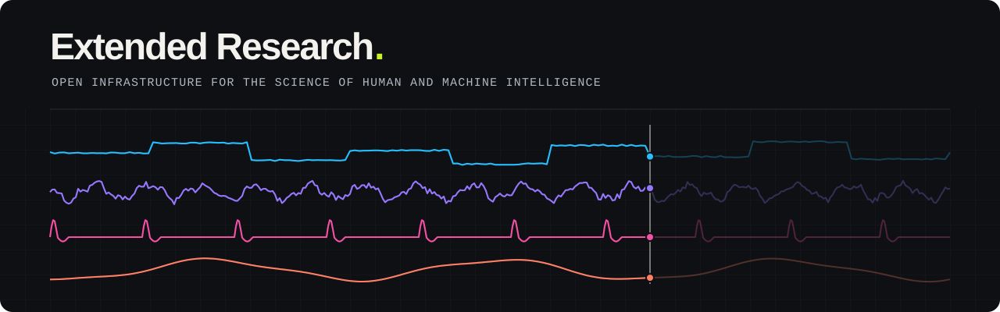

  

Extended Research develops open-source software for studies of human behaviour
and cognition: running several instruments in one study, storing the data they
produce, and describing the protocol that produced it. The work is intended for
research in psychology, neuroscience, neuroAI, human-centred AI, clinical
outcomes, rehabilitation, and biomechanics.

More to come. Stay tuned.
